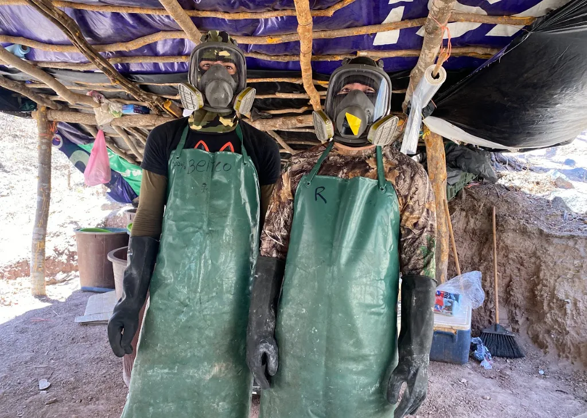
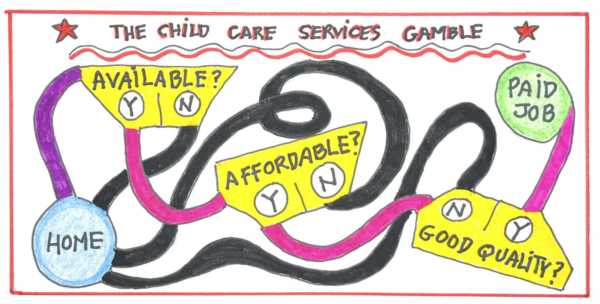

# PhD dissertation 

---
**Drug-led development? Illegal firms and local employment in Mexico** 
This study examines the impact of drug trafficking organizations on local employment structures in Mexican municipalities and commuting zones from 1990 to 2020. Using data from the Population and Economic Censuses, along with datasets on cartel presence identified from web content, I construct a panel of municipalities and economic sectors. The identification strategy employs difference-in-difference and synthetic control methods to assess the effects of drug trafficking organizations on employment by sector and occupation. Additionally, I estimate the extent to which these effects are driven by shifts in the legal sector versus increased labor demand in the illegal drug sector.

[Image credit: Mallika Vora for the New Yorker](https://www.newyorker.com/news/dispatch/searching-with-the-mothers-of-mexicos-disappeared){:target="_blank"}

---

**Drug Lords in STEM: the shift to synthetic drugs and structural change in Mexico**

---

**Growing Up Around Cartels: Salience of Criminal Careers and Youth's Education Choices in Mexico**

---

# Other projects 

---

**[Moral Force: Leaders’ Actions and Public Health Compliance in Crisis](documents/MoralForce_202409.pdf){:target="_blank"}**  *with [L. Guillermo Woo-Mora](woomora.github.io){:target="_blank"}, Maximo Ponce de León and Federico Daverio-Occhini.*

  
 Abstract 
 
   
  <blockquote>
    Charismatic leaders shape public sentiment and moral direction but can weaken institutions by prioritizing personal appeal over trust in government. During the COVID-19 pandemic, the Mexican president disregarded his administration’s stay-at-home guidelines. We analyze the impact of his actions on social distancing compliance using granular mobility and electoral data. A dynamic difference-in-difference design reveals increased mobility in pro-president areas, leading to 22% more COVID-19 cases and 30% more deaths. Our findings suggest the president’s example, rather than partisan differences, drove these effects, highlighting the critical need for leaders to align personal conduct with public policy.
  </blockquote>
 

 

*[Working paper](documents/MoralForce_202409.pdf)*

---

**[Embracing modernity pays: Cadastre modernization effects on local property tax collection](documents/Draft_CAF.pdf)** with Emmanuel Chávez and Guillermo Woo-Mora.
*Funded by [CAF Development Bank of Latin America and the Caribbean](https://www.caf.com/en/currently/calls/2023/09/call-for-research-proposals-subnational-capacities-and-decentralization-in-latin-america-and-the-caribbean/){:target="_blank"}.*

  
 Abstract 
 
   
  <blockquote>
    This paper investigates the impact of the Mexican cadastre modernization program on local property tax revenue. We evaluate a comprehensive modernization initiative, which began in 2010 and included guidelines, technical assistance, and subsidies for local cadastres. Using panel data from 2000 to 2019 and a Difference-in-Differences approach, we find that municipalities adopting the program saw a 10% increase in property tax revenue within five years, rising to 30% after eight years. This effect varies significantly with local state capacity and the coordinating institution implementing the program. The program significantly enhances the state of local cadastres over the long term. Municipalities that adopt the program are more likely to invest in staff training, implement comprehensive cadastral management systems, and digitize their registries. Our results highlight the importance of local capacities and coordination in realizing the benefits of decentralization and modernization policies.
  </blockquote>
 

 

*[Working paper](documents/Draft_CAF.pdf)*

---

**[Filling the Gaps: Childcare Laws for Women’s Economic Empowerment](https://elibrary.worldbank.org/doi/abs/10.1596/1813-9450-10492)** With [S Anukriti](https://sites.google.com/view/s-anukriti/home){:target="_blank"} , [Lelys Dinarte-Diaz](https://sites.google.com/view/lelys-dinarte/home){:target="_blank"} , Marina Elefante and Alena Sakhonchik. 

  
 Abstract 
 
   
  <blockquote>
    This paper aims to provide global evidence on whether and what attributes of laws governing the provision of childcare services affect women's labor market outcomes. It merges country-year-level data from the World Bank's Women, Business and the Law database, which documents childcare laws across countries, with data on women's labor force participation from ILOSTAT. Using a difference-in-difference estimation framework, the analysis finds that the enactment of childcare laws increases women's labor force participation by 2 percent, on average. Moreover, the effect increases over time, reaching up to 4 percent five years after an enactment. This effect is driven by women who are married, have completed less than primary education, and are between the ages of 35 and 44. Lastly, regulation of the availability and affordability of childcare has a similar impact on female labor force participation, whereas the effect of quality regulation is smaller.
  </blockquote>
 

 

*[Blog post](https://www.revaluingcare.org/can-child-care-legislation-increase-womens-participation-in-the-paid-labor-force/) in the Care Talk Blog* 

*[Blog post](https://blogs.worldbank.org/impactevaluations/childcare-regulation-and-womens-participation-labor-force) in the World Bank Development Impact Blog*

---

**[Mitigating Poverty: Global Estimates of the Impact of Income Support during the Pandemic]([documents/Draft_CAF.pdf](https://www.undp.org/sites/g/files/zskgke326/files/2021-07/UNDP-DFS-Mitigating-Poverty-Global-Estimates-of-the-Impact-of-Income-Support-during-the-Pandemic-EN.pdf))** With Johanna Fajardo-Gonzalez, George Gray Molina, and Eduardo Ortiz-Juarez.

  
 Abstract 
 
   
  <blockquote>
    This paper reconstructs the full welfare distributions from household surveys of 160 countries, covering
    96.5 percent of the global population, to estimate the pandemic-induced increases in global poverty
    and provide information on the potential short-term effects of income-support programmes on mitigating
    such increases. Crucially, the analysis performs a large-scale simulation by combining the welfare
    distributions with the database of social protection measures of Gentilini et al. (2021) and estimates such
    effects from 72 actual income-support programmes planned or implemented across 41 countries. The
    paper reports three findings: First, the projection of additional extreme poverty, in the absence of income
    support, ranges between 117 million people under a distributive-neutral projection and 168 million
    people under a distributive-regressive projection —which may better reflect how the shock impacted
    poor and vulnerable households. Second, a simulation of the hypothetical effects of a temporary basic
    income with an investment of 0.5 percent of developing countries’ GDP, spread over six months, finds
    that this amount would mitigate to a large extent, at least temporarily, the increase in global poverty
    at both the $1.90- and $3.20-a-day thresholds, although poverty would still increase significantly in the
    poorest regions of the world. Third, the analysis of income-support programmes in 41 countries suggests
    that they may have mitigated, at least temporarily, the overall increase in poverty in upper-middle
    income countries but may have been insufficient to mitigate the increase in poverty at any poverty
    line in low-income countries. Income support likely mitigated 60 percent of the increase in poverty at
    the $3.20-a-day threshold and 20 percent at the $5.50-a-day threshold among lower-middle-income
    countries. This pattern is correlated with the amount of social assistance per capita payments made in
    each country

  </blockquote>
 

 

---
