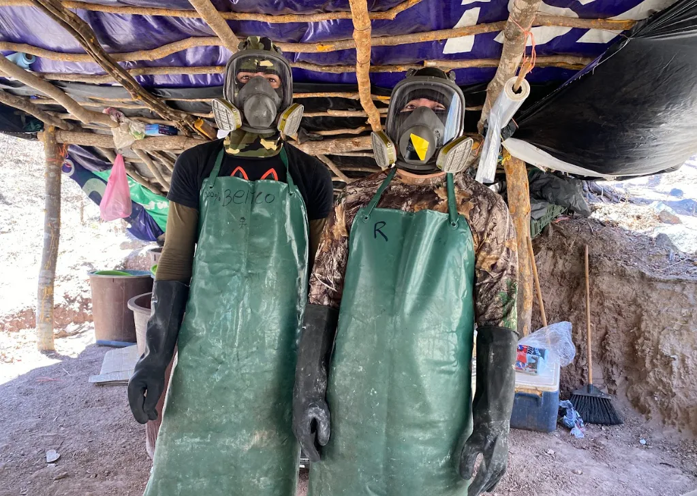
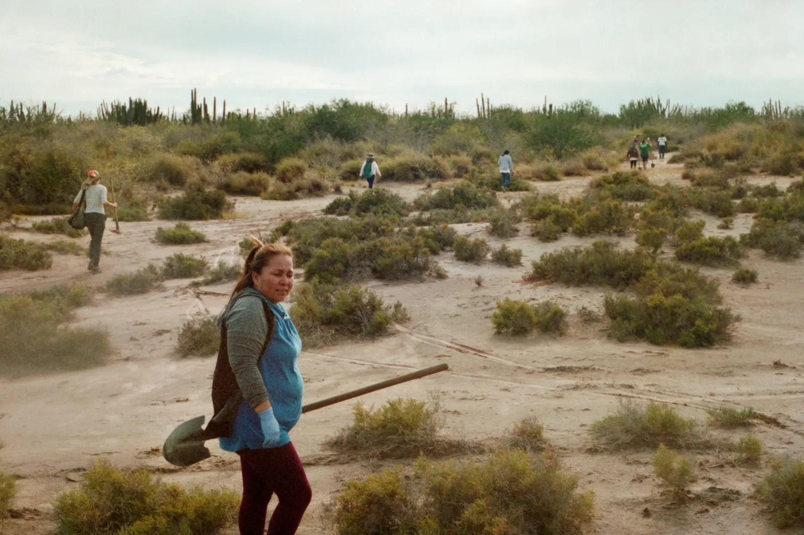

# Working Papers 
---

**Drug Lords in STEM** · *Job Market Paper*

  
 Abstract 
 
   
  <blockquote>
A long-standing view in economics holds that education protects against criminal involvement by improving legal labor market opportunities. But what happens when education becomes a qualification for illegal employment? I study how skill-biased technical change in illegal labor markets affects human capital investment, exploiting the synthetic drug production boom in Mexico, which created criminal demand for workers with chemistry skills. Using China's April 2019 fentanyl ban as a shock that accelerated Mexican domestic production, I compare educational outcomes in commuting zones with pre-existing synthetic drug infrastructure to those without. Water quality monitoring confirms that exposed areas exhibit the chemical signature of drug production synthesis in the following years. Exposure to synthetic drug production reduces middle school dropout by 21\% and high school dropout by 8\%, increases time spent studying, and raises tertiary enrollment in chemistry-intensive STEM programs by 6\%, with no effect on other fields. These findings demonstrate that when illegal markets demand skilled labor, criminal opportunities boost human capital investment towards skills specific to illegal production.
  </blockquote>
 

 

---
**Drug-led development? Organized crime and local employment in Mexico** 

  
 Short abstract 
 
   
  <blockquote>
This paper looks at the impact of drug trafficking organizations on local employment structures in Mexican municipalities and commuting zones from 1990 to 2020. Using data from the Population and Economic Censuses, along with datasets on cartel presence identified from web content, I construct a panel of municipalities and economic sectors. The identification strategy employs difference-in-difference and synthetic control methods to assess the effects of drug trafficking organizations on employment by sector and occupation. Additionally, I estimate the extent to which these effects are driven by shifts in the legal sector versus increased labor demand in the illegal drug sector.
  </blockquote>
 

 

[Image credit: Mallika Vora for the New Yorker](https://www.newyorker.com/news/dispatch/searching-with-the-mothers-of-mexicos-disappeared){:target="_blank"}

---

**[Moral Force, Contagious Force: Partisanship, Leadership, and Public Health Compliance during COVID-19](https://papers.ssrn.com/sol3/papers.cfm?abstract_id=3678980){:target="_blank"}**  *with [L. Guillermo Woo-Mora](woomora.github.io){:target="_blank"}  and Federico Daverio-Occhini.* **Submitted** 

  
 Abstract 
 
   
  <blockquote>
    How does partisanship shape compliance with public health guidance and related health outcomes? During Mexico’s COVID-19 campaign, the president publicly undermined distancing measures even as his administration promoted them. Using precinct-level mobility data and a novel shift–share IV application, we show that support for the president’s party increased mobility within municipalities. We confirm these patterns across municipalities, where greater partisan support predicts higher infections and deaths. A calibrated epidemiological model attributes most of the infection gap to partisan behavior. The evidence supports a leader-driven mechanism in which elite cues, rather than fixed partisan traits, shape compliance during crises.
  </blockquote>
 

 

---

**[Embracing modernity pays: Cadastre modernization effects on local property tax collection](documents/Draft_CAF.pdf)** with Emmanuel Chávez and Guillermo Woo-Mora.

*Honorable Mention at the Premio Banamex de Economía 2024* 

  
 Abstract 
 
   
  <blockquote>
    This paper investigates the impact of the Mexican cadastre modernization program on local property tax revenue. We evaluate a comprehensive modernization initiative, which began in 2010 and included guidelines, technical assistance, and subsidies for local cadastres. Using panel data from 2000 to 2019 and a Difference-in-Differences approach, we find that municipalities adopting the program saw a 10% increase in property tax revenue within five years, rising to 30% after eight years. This effect varies significantly with local state capacity and the coordinating institution implementing the program. The program significantly enhances the state of local cadastres over the long term. Municipalities that adopt the program are more likely to invest in staff training, implement comprehensive cadastral management systems, and digitize their registries. Our results highlight the importance of local capacities and coordination in realizing the benefits of decentralization and modernization policies.
  </blockquote>
 

 

*[Working paper](documents/Draft_CAF.pdf)*

---

# Work in progress
**Evaluating Demand- and Supply-Side Interventions Against Organized Crime Recruitment in Peru** with Natalia Guerrero-Trinidad and Maria Micaela Sviatschi

**From Labs to Rivers: Environmental and Health Consequences of Mexico’s Fentanyl Boom** with Sandra Aguilar-Gómez

**Algorithmic Gender Gaps: How TikTok Shapes Gender Norms Among Adolescents in El Salvador** with Lelys Dinarte-Diaz

**DICE-MX: A Georeferenced Event-Level Dataset of Drug Interdiction and Criminal Events in Mexico** 

# Resting papers

---

**[Mitigating Poverty: Global Estimates of the Impact of Income Support during the Pandemic](https://www.undp.org/sites/g/files/zskgke326/files/2021-07/UNDP-DFS-Mitigating-Poverty-Global-Estimates-of-the-Impact-of-Income-Support-during-the-Pandemic-EN.pdf)** with Johanna Fajardo-Gonzalez, George Gray Molina, and Eduardo Ortiz-Juarez.
**Pre-PhD**

  
 Abstract 
 
   
  <blockquote>
    This paper reconstructs the full welfare distributions from household surveys of 160 countries, covering
    96.5 percent of the global population, to estimate the pandemic-induced increases in global poverty
    and provide information on the potential short-term effects of income-support programmes on mitigating
    such increases. Crucially, the analysis performs a large-scale simulation by combining the welfare
    distributions with the database of social protection measures of Gentilini et al. (2021) and estimates such
    effects from 72 actual income-support programmes planned or implemented across 41 countries. The
    paper reports three findings: First, the projection of additional extreme poverty, in the absence of income
    support, ranges between 117 million people under a distributive-neutral projection and 168 million
    people under a distributive-regressive projection —which may better reflect how the shock impacted
    poor and vulnerable households. Second, a simulation of the hypothetical effects of a temporary basic
    income with an investment of 0.5 percent of developing countries’ GDP, spread over six months, finds
    that this amount would mitigate to a large extent, at least temporarily, the increase in global poverty
    at both the $1.90- and $3.20-a-day thresholds, although poverty would still increase significantly in the
    poorest regions of the world. Third, the analysis of income-support programmes in 41 countries suggests
    that they may have mitigated, at least temporarily, the overall increase in poverty in upper-middle
    income countries but may have been insufficient to mitigate the increase in poverty at any poverty
    line in low-income countries. Income support likely mitigated 60 percent of the increase in poverty at
    the $3.20-a-day threshold and 20 percent at the $5.50-a-day threshold among lower-middle-income
    countries. This pattern is correlated with the amount of social assistance per capita payments made in
    each country

  </blockquote>
 

 

---
