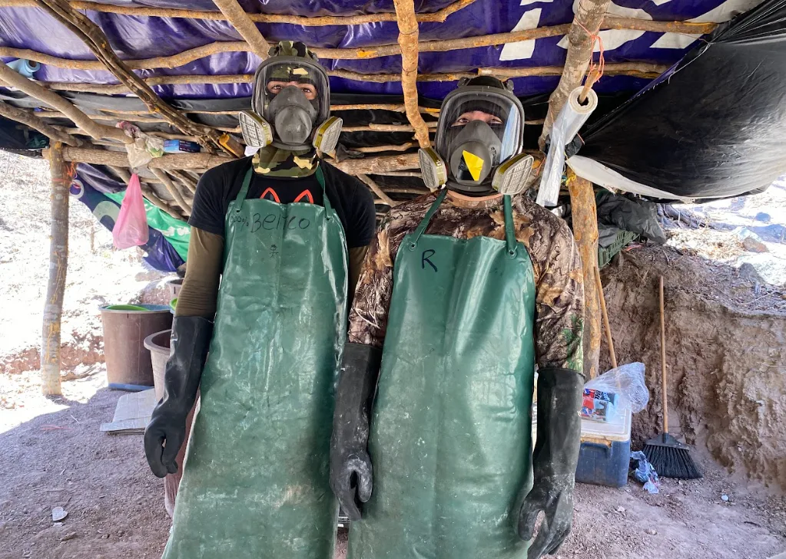
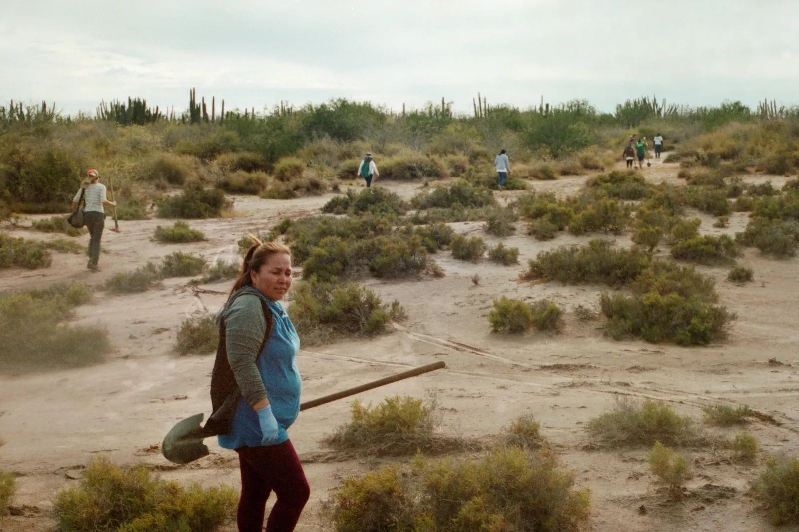

<!-- Coauthor websites: replace each # with the link. Use in text as [Name][key] -->
[anukriti]: #
[dinarte]: #
[sakhonchik]: #
[guerrero]: #
[sviatschi]: #
[aguilar]: #
[woomora]: https://woomora.github.io
[daverio]: #
[chavez]: #

# Job Market Paper
---

**Drug Lords in STEM**  
*<u>Awards:</u> [EEA Young Economist Award](https://eeassoc.org/awards/young-economist-award){:target="_blank"}; [Horowitz Foundation Dissertation Award](https://www.horowitz-foundation.org/){:target="_blank"}*
{: .award}

[Image credit: El Universal](https://www.eluniversal.com.mx/nacion/fentanilo-viaje-a-una-cocina-del-cartel-de-sinaloa/){:target="_blank"}
{: .credit}

<blockquote>
Education is widely viewed as a protective factor against criminal involvement because it improves legal labor-market opportunities. But what happens when illegal markets demand skilled labor? I study how a boom in chemistry-intensive illegal drug production reshaped human capital investment in Mexico. China's 2019 ban on fentanyl pushed its synthesis into clandestine Mexican laboratories, expanding synthetic drug production and the demand for chemistry skills. Using a difference-in-differences design, I compare commuting zones with pre-existing synthetic-drug infrastructure to those without before and after the ban. Water-quality monitoring data confirm that exposed areas exhibit the byproducts of drug synthesis. Exposure reduces school dropout, increases time spent studying, and raises the share of students who start the final year of high school. Tertiary enrollment in chemistry-related STEM programs also rises, with no change in other fields, confirming a skill-specific shock rather than an income effect. The demand for chemistry skills spills over to the legal sector: exposure increases the wage premium on chemistry-related degrees and employment in chemistry occupations. Meanwhile, older credentialed chemists disappear from the data, consistent with entry into concealed production.
</blockquote>
 

# Publications
---

**[Filling the Gaps: Childcare Laws for Women’s Economic Empowerment](https://www.aeaweb.org/articles?id=10.1257/pandp.20251131){:target="_blank"}** with [S. Anukriti][anukriti], [Lelys Dinarte-Diaz][dinarte] and [Alena Sakhonchik][sakhonchik].  *AEA Papers & Proceedings* 

# Work in progress
---

**Evaluating Demand- and Supply-Side Interventions Against Organized Crime Recruitment** with [Natalia Guerrero-Trinidad][guerrero] and [Micaela Sviatschi][sviatschi]

*Baseline data collected*
{: .status}

*<u>Grants:</u> IPA Citizen Security Research Initiative (co-PI)*
{: .award}

  
 Description:
 
  <blockquote>
Preventing criminal recruitment of young people is crucial to weaken organized crime. Interventions to prevent recruitment have so far worked on one side of this labor market at a time, by either focusing on changing the organization's ability to recruit or the individual willingness to engage in crime. This project will study their interaction and complementarity in the context of Peru, where half of those detained for contract killing in Lima Metropolitana are minors aged fifteen to seventeen and recruitment is contested among different criminal groups. Our diagnostic survey of 2,505 students across 53 schools identifies that adolescents in high-risk areas are less able to recognize recruitment tactics, are more present-biased, and believe legitimate mobility is unattainable. Recruitment is likely to succeed because every initial offer is immediate, small, and personal. In collaboration with Lima's regional education authority, we are developing PREPARE, a curriculum delivered across schools to using AI-assisted visualization to make each student's own future at twenty-five equally vivid. The research design is a four-arm cluster-randomized trial crossing the curriculum with a police program, under which officers are assigned to individual secondary schools for the academic year to run prevention activities and feed local observations into a national risk map. This will yield the first evidence on whether demand- and supply-side prevention strategies can complement or substitute in this setting to reduce crime, prevent recruitment, and change students' beliefs.
  </blockquote>
 

---

**Exporters into Retailers: Foreign Interdiction and the Formation of Drug Markets around Schools** with [Natalia Guerrero-Trinidad][guerrero] and [Micaela Sviatschi][sviatschi]

*Data collection ongoing*
{: .status}

  
 Description:
 
  <blockquote>
Drug consumption is rising in transit countries in Latin America, but little is known about how domestic retail drug markets are formed in the developing world. This paper studies whether enforcement abroad creates them. Seizures in destination markets destroy a trafficking organization's inventory and capital, leaving a liquidity-constrained exporter with product that is harder to sell abroad and intermediaries who are often paid in kind; like legal exporters facing trade shocks, the organization may redirect supply to the domestic market. We study Ecuador, a main departure point for cocaine seized in Europe, exploiting quasi-random variation in the timing of European seizures traced to specific Ecuadorian wholesale routes in a dynamic difference-in-differences design across affected and unaffected routes. Using geolocated wholesale and retail seizures and detentions, we estimate the effect of foreign interdiction on domestic retail supply. Because retail is labor-intensive, we then test whether new retail activity locates near schools, where potential recruits are concentrated, and, linking police records to school enrollment histories, whether it spreads through schools with pre-existing ties to criminal networks and increases criminal involvement among exposed cohorts.
  </blockquote>
 

---

**Deter or displace? Securing schools against organized crime in Ecuador** with [Natalia Guerrero-Trinidad][guerrero] 

*Baseline data collection ongoing*
{: .status}

  
 Description:
 
  <blockquote>
Schools have strategic value for criminal organizations as recruitment sites, but also as territories they can control and use for criminal activity. Youth involved with criminal groups increasingly stay in school to recruit, to extort peers and staff, as well as to store and sell drugs. This project evaluates how criminal groups respond to a state program to secure schools in high-crime areas in Ecuador through patrolling and intelligence operations in their vicinity as well as in-school prevention activities. We exploit eligibility cutoffs and quasi-random variation in untreated schools' distance to treated ones, which creates schools exposed to both program components, to only the external component, or to neither. This allows to test whether securing schools deters criminal activity or displaces it to other schools, other populations, or other crimes. We collect data from independent structured observations of police presence and criminal activity, surveys of students and school staff, and high-frequency reports of incidents, and combine them with administrative crime data covering homicides, detentions, criminal reports, and intelligence on criminal group presence and membership.
  </blockquote>
 

---

**DICE-MX: Drug Interdiction and Criminal Enforcement in Mexico**

*<u>Grants:</u>  IPA Citizen Security Research Initiative (PI)*
{: .award}

  
 Description:
 
  <blockquote>
Systematic, event-level data on state enforcement against drug trafficking organizations in Mexico remains scarce, fragmented, and hard to obtain as administrations change. Funded by IPA Citizen Security Research Initiative, DICE-MX is a structured, event-level dataset of federal drug enforcement in Mexico — seizures, arrests, lab dismantlements, operations — extracted with LLMs from the press releases of federal security agencies and other complementary sources. For each event, we extract detailed attributes including the agencies and people involved, the type and quantity of the seizures, and precise dates and locations.  The project is also designed to validate a methodology for extracting rich information events from unstructured text sources with readily-available AI models. We benchmark the LLM pipeline against a stratified sample of hand-coded press releases to assess extraction accuracy by event type. We also characterize the coverage and selection biases of official communications by comparing a bounded subset of events against administrative records, a corpus of narcoblog reports, and directly curated news coverage. The result will be a transparent, reproducible, and costed framework for AI-assisted data construction, which we are extending to other applications, so it can be used wherever texts describing events are available. The dataset will be made publicly available to facilitate research on the effects of enforcement on criminal organizations.
  </blockquote>
 

---
**Drug-led development? Organized crime and local employment in Mexico** 

  
 Abstract: 
 
  <blockquote>
What happens to a local economy when organized crime arrives? Organized crime can play different economic roles in the places where it operates. It governs territory, taxing legal activity through extortion and control, but it can also produce, employing local labour, demanding intermediate inputs, and bringing income. This paper studies how each role reshapes the sectoral structure of Mexican municipalities by contrasting expansions in criminal presence to control trafficking routes vs. production sites. To isolate governance, I use crackdowns triggered by close mayoral elections, which diverted drug-trafficking routes across the road network and brought organized crime into municipalities unrelated to their own economic path. To isolate production, I use the boom and bust in Mexican opium: rising US heroin demand after 2010, followed by a price collapse as fentanyl displaced heroin. Combining these shocks with confidential microdata from Economic Censuses from 1998 to 2023, I measure effects on which sectors are present, sectoral concentration, and the structure of employment. 
  </blockquote>
 

[Image credit: Mallika Vora for the New Yorker](https://www.newyorker.com/news/dispatch/searching-with-the-mothers-of-mexicos-disappeared){:target="_blank"}
{: .credit}

---

**From Labs to Rivers: Environmental and Health Consequences of Mexico’s Fentanyl Boom** with [Sandra Aguilar-Gómez][aguilar]

*Data collection ongoing*
{: .status}

---

**[Moral Force, Contagious Force: Partisanship, Leadership, and Public Health Compliance during COVID-19](https://papers.ssrn.com/sol3/papers.cfm?abstract_id=3678980){:target="_blank"}**  with [L. Guillermo Woo-Mora][woomora]  and [Federico Daverio-Occhini][daverio].

 

  
 Abstract: 
 
  <blockquote>
    This project studies whether partisan behavior during crises reflect fixed dispositions or malleable responses to elite cues. The two accounts predict similar partisan gaps when leaders reinforce supporters' prior beliefs, but diverge when the same leader changes course. Mexico provides such a reversal: President López Obrador publicly undermined his government's March 2020 distancing campaign, then endorsed vaccination on national television one year later. Combining high-frequency mobility data, electoral returns, and COVID-19 records, we estimate the partisan mobility gap using a difference-in-differences event study, complemented by a recentered lottery instrument for local Morena presence. The dynamics are more consistent with responsiveness to changing cues. Areas with stronger Morena support reduced out-of-home mobility by less after the distancing announcement; the pattern appears across electoral sections, municipalities, and local labor markets, and narrows as local infections rise. Vaccination later increased more in the same areas, with no comparable pattern in routine immunization. Higher-Morena areas also recorded more early cases and deaths, and a dynamic two-group SIRD model attributes roughly one quarter of these conditional gaps to differential mobility. The reversal is difficult to reconcile with fixed dispositions alone and more consistent with responsiveness to changing leader cues.
  </blockquote>
 

---

**[Embracing modernity pays: Cadastre modernization effects on local property tax collection](documents/Draft_CAF.pdf)** with [Emmanuel Chávez][chavez] and [Guillermo Woo-Mora][woomora].

*<u>Grants</u>: CAF. Decentralización y Capacidades Subnacionales en América Latina y El Caribe 2023.*
*<u>Awards</u>: Premio Banamex de Economía 2024, Honorable Mention*
{: .award}

  
 Abstract: 
 
  <blockquote>
    This paper investigates the impact of the Mexican cadastre modernization program on local property tax revenue. We evaluate a comprehensive modernization initiative, which began in 2010 and included guidelines, technical assistance, and subsidies for local cadastres. Using panel data from 2000 to 2019 and a Difference-in-Differences approach, we find that municipalities adopting the program saw a 10% increase in property tax revenue within five years, rising to 30% after eight years. This effect varies significantly with local state capacity and the coordinating institution implementing the program. The program significantly enhances the state of local cadastres over the long term. Municipalities that adopt the program are more likely to invest in staff training, implement comprehensive cadastral management systems, and digitize their registries. Our results highlight the importance of local capacities and coordination in realizing the benefits of decentralization and modernization policies.
  </blockquote>
 

---

